# PM10 Air Quality Forecasting — Kraków

**End-to-end machine learning system for daily PM10 concentration forecasting in Kraków, Poland.**  
Covers data engineering, exploratory analysis, multi-model forecasting, SHAP explainability, a REST API, and an interactive web dashboard — all containerised with Docker.

---

## Table of Contents

1. [Project Overview](#1-project-overview)
2. [Project Architecture](#2-project-architecture)
3. [Data Loading](#3-data-loading)
4. [Data Preprocessing](#4-data-preprocessing)
5. [Exploratory Data Analysis](#5-exploratory-data-analysis)
6. [Feature Engineering](#6-feature-engineering)
7. [Modeling](#7-modeling)
8. [Evaluation](#8-evaluation)
9. [Advanced Analysis](#9-advanced-analysis)
10. [Streamlit Application](#10-streamlit-application)
11. [FastAPI Backend](#11-fastapi-backend)
12. [Docker Setup](#12-docker-setup)
13. [Business Insights](#13-business-insights)
14. [Conclusion](#14-conclusion)
15. [How to Run](#15-how-to-run)

---

## 1. Project Overview

Kraków ranks among the most polluted cities in Europe during winter months. PM10 — particulate matter with a diameter of 10 micrometres or less — poses serious health risks, particularly for people with respiratory and cardiovascular conditions. Daily 24-hour average concentrations frequently exceed the EU regulatory limit of **50 µg/m³**, triggering public-health advisories and transport restrictions.

This project builds a **production-ready forecasting system** that predicts the next-day (and multi-day) PM10 concentration at the Wadowicka monitoring station (`MpKrakWadow`) in Kraków.

**System summary:**

| Layer | Technology |
|---|---|
| ML pipeline | Jupyter Notebook + modular `src/` package |
| Models | LightGBM, SARIMAX, ARIMA, Prophet |
| Explainability | SHAP (SHapley Additive exPlanations) |
| REST API | FastAPI + Uvicorn |
| Dashboard | Streamlit ("AirPulse Kraków") |
| Containerisation | Docker + Docker Compose |

---

## 2. Project Architecture

```
.
├── notebooks/
│   └── air_quality_forecast.ipynb   # Main analysis and modelling notebook
├── src/                             # Modularised pipeline (extracted from notebook)
│   ├── data_loading.py              # PM10 Excel ingestion + Open-Meteo weather fetch
│   ├── data_preprocessing.py        # Gap imputation, weather merge
│   ├── feature_engineering.py       # Full feature pipeline (Box-Cox, lags, rolling, etc.)
│   ├── models.py                    # ARIMA, SARIMAX, Prophet, LightGBM training
│   ├── evaluation.py                # Metrics, plots, exceedance analysis
│   ├── eda.py                       # EDA plots
│   ├── config.py                    # Central constants (stations, dates, hyperparams)
│   └── utils.py                     # Logger, Box-Cox inverse, plot helpers
├── backend/
│   ├── api.py                       # FastAPI app (predict / explain / interpret / metrics)
│   ├── schemas.py                   # Pydantic request/response models
│   └── services/
│       ├── model_service.py         # Model loading, prediction, regime classification
│       ├── explainability_service.py# SHAP computation
│       └── interpretability_service.py # Rule-based NLG forecast explanations
├── frontend/
│   └── app.py                       # Streamlit dashboard ("AirPulse Kraków")
├── config/
│   └── config.py                    # Shared config (API host, thresholds, colours)
├── scripts/
│   └── prepare_api_artifacts.py     # One-off: serialise models → models/
├── models/                          # Serialised artefacts (*.pkl, *.joblib)
├── data/                            # Raw yearly PM10 Excel files (2019–2024)
├── images/                          # All generated plots
├── docker-compose.yml
├── requirements.txt
└── main.py                          # CLI entry-point for the full pipeline
```

### Component interaction

```
┌───────────────────────┐    HTTP     ┌───────────────────────┐
│   Streamlit Frontend  │ ──────────► │   FastAPI Backend     │
│   (port 8501)         │ ◄────────── │   (port 8000)         │
└───────────────────────┘             └──────────┬────────────┘
                                                 │ loads
                                      ┌──────────▼────────────┐
                                      │  models/*.pkl/.joblib  │
                                      │  (LightGBM, ARIMA,    │
                                      │   SARIMAX, KMeans,    │
                                      │   scaler, history)     │
                                      └───────────────────────┘
```

The **Streamlit frontend** collects weather inputs and forecast parameters from the user, forwards them to the **FastAPI backend**, and renders the returned forecasts, confidence intervals, SHAP contributions, and AI-generated narrative. All trained models are serialised as `.pkl` / `.joblib` artefacts and loaded into memory at API startup. The `src/` modules contain the same logic as the notebook but are importable as a library, used by both `scripts/prepare_api_artifacts.py` and the backend services.

---

## 3. Data Loading

### Sources

| Source | Format | Coverage |
|---|---|---|
| GIOŚ (Polish Chief Inspectorate for Environmental Protection) | Excel (`.xlsx`) | 2019–2024, daily 24-hour PM10 averages |
| Open-Meteo Archive API | JSON via HTTP | Daily weather for Kraków (2019–2024) |

### PM10 data

The GIOŚ export format places the header row (`Kod stacji`) at a variable row position depending on the year. The loader scans each file to find this row before re-reading with the correct `header` argument:

```python
load_pm10_raw(data_dir, years=range(2019, 2025))
```

Four Kraków monitoring stations are retained:

| Code | Location |
|---|---|
| `MpKrakWadow` | Wadowicka (primary target) |
| `MpKrakSwoszo` | Swoszowice |
| `MpKrakBujaka` | Bujaka |
| `MpKrakBulwar` | Bulwarowa |

Decimal separators in the GIOŚ export use commas (Polish locale); these are normalised to dots during parsing. A strict daily `DatetimeIndex` is enforced via `asfreq('D')`, inserting `NaN` for any missing dates.

### Weather data

Daily meteorological variables are fetched from the **Open-Meteo** archive endpoint:

- Temperature (avg, min, max)
- Precipitation (rain sum, snowfall sum)
- Wind (mean speed, max gust, dominant direction)
- Relative humidity (avg)
- Surface pressure (avg)

Dominant wind direction is encoded as **sin/cos cyclical features** immediately after download to preserve the circular topology (i.e., NW and N are close; N and S are far).

---

## 4. Data Preprocessing

### Steps and rationale

| Step | What it does | Why it's needed |
|---|---|---|
| Header detection | Locates `Kod stacji` row dynamically | GIOŚ format varies by year |
| Datetime conversion | `pd.to_datetime` with `errors='coerce'` | Non-date rows (metadata) become `NaT` and are dropped |
| `asfreq('D')` | Enforces strict daily frequency | Gaps would silently misalign lag features |
| Short-gap interpolation | Time-based linear interpolation for gaps ≤ 3 days | Sensor outages of 1–3 days are common and interpolation is reliable |
| Long-gap flagging | Binary `{station}_long_gap` column for gaps > 3 days | Avoids artificially constructing data where readings are genuinely absent |
| Boundary fill | `ffill()` / `bfill()` | Closes isolated NaNs at the start or end of the series after interpolation |
| Weather merge | Left join PM10 DataFrame on date index | Attaches meteorological context to each observation |

Short gaps are interpolated on a **time axis** (not row index) to respect the irregular distribution of readings. Long gaps are preserved as `NaN` with a companion indicator feature so the model can learn that the context is unreliable.

---

## 5. Exploratory Data Analysis

### Time series overview

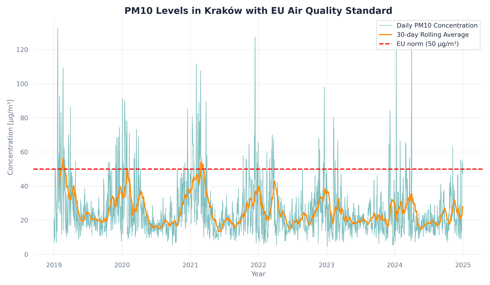

The raw PM10 series for `MpKrakWadow` (2019–2024) reveals a strong annual seasonality with pronounced **winter spikes** driven by residential coal and biomass combustion. Clean summer periods with concentrations below 20 µg/m³ contrast sharply with heating-season episodes exceeding 200 µg/m³. The COVID-19 lockdowns in early 2020 produced a brief but notable reduction in baseline levels.

---

### Monthly distribution

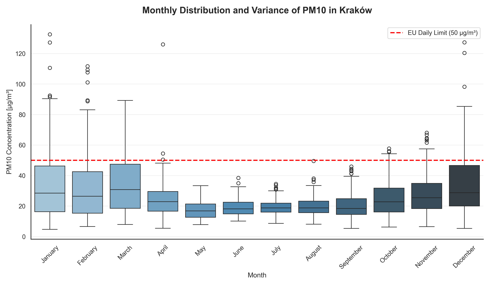

Boxplots by calendar month confirm that median PM10 is approximately **3–5× higher in winter (December–February) than in summer (June–August)**. The interquartile range also widens considerably in winter, reflecting greater day-to-day variability driven by weather conditions (wind speed, temperature inversions, precipitation). The EU daily limit of 50 µg/m³ is routinely breached from October through March.

---

### Year × Month heatmap

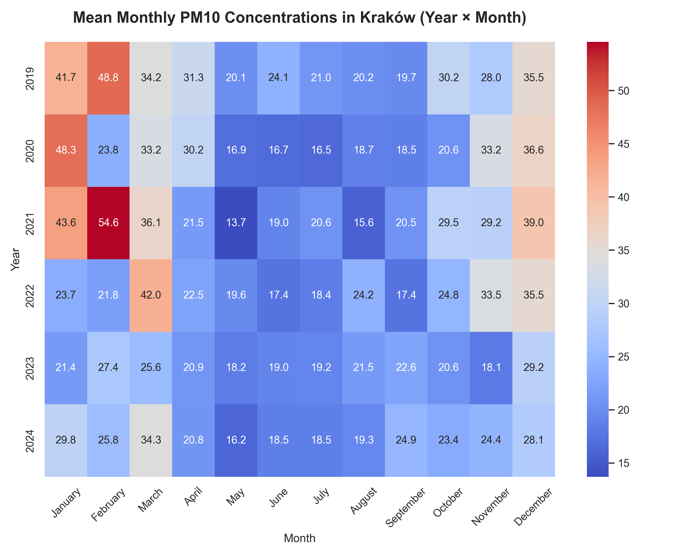

The heatmap of mean monthly PM10 by year reveals that **2020 and 2022 had notably cleaner winters**, while **2023 and early 2024 saw elevated concentrations**. Year-over-year variation is substantial, reflecting both meteorological differences and gradual policy changes (e.g., the Małopolska anti-smog resolution restricting solid-fuel heating).

---

### STL decomposition

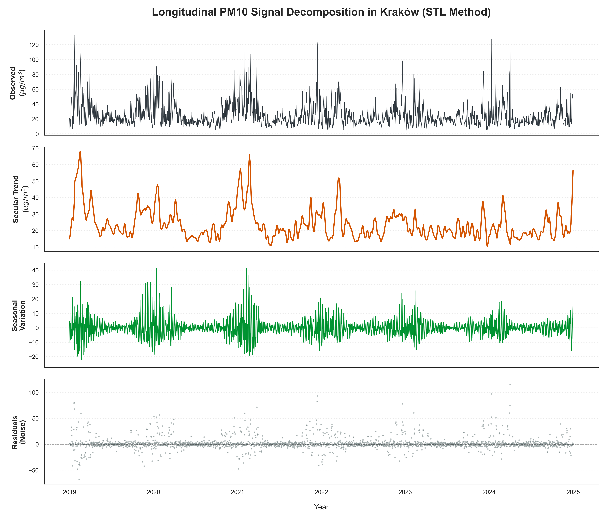

STL (Seasonal-Trend decomposition using LOESS) separates the signal into trend, seasonal, and residual components. The seasonal component confirms a dominant annual cycle. The residuals exhibit heteroscedasticity — variance is higher in winter — which motivates the **Box-Cox transformation** applied in feature engineering.

---

## 6. Feature Engineering

The full feature pipeline is implemented in `src/feature_engineering.py` and runs in a fixed order to prevent data leakage.

### Feature groups

**Calendar features**
- `month`, `year`, `season`, `is_weekend`, `is_holiday` (Polish public holidays)
- Cyclical encoding: `month_sin/cos`, `doy_sin/cos`, `dow_sin/cos` — removes artificial discontinuities at year/week boundaries

**Box-Cox transformation**
- Lambda is estimated exclusively on training data, then applied to the full series
- Stabilises variance and normalises the heavy right tail of PM10, which improves both tree-based and statistical model performance

**Lag features** (computed on the Box-Cox-transformed target)
- `lag_1d`, `lag_2d`, `lag_7d`, `lag_14d`
- Yesterday's PM10 is the single strongest predictor; weekly lags capture the seasonal autocorrelation structure

**Rolling statistics** (computed on raw PM10 with `shift(1)` to prevent leakage)
- `rolling_mean_{3,7,14,30}d`, `rolling_std_{3,7,14,30}d`
- `rolling_diff_7d` (7-day minus 14-day mean): captures whether pollution is accelerating

**Weather-derived features**

| Feature | Description |
|---|---|
| `is_frost` | Temperature ≤ 0 °C — proxy for increased heating demand |
| `is_calm_wind` | Wind mean ≤ 2 m/s — weak dispersion of pollutants |
| `wind_inverse` | 1 / (wind_max + 0.1) — non-linear dispersion proxy |
| `heating_degree_days` | max(0, 15 − temp_avg) — physical heating demand |
| `hdd_7d` | 7-day rolling HDD sum — accumulated thermal demand |
| `rain_yesterday`, `rain_3d_sum`, `rain_7d_sum` | Washout effects of recent precipitation |
| `dry_spell_days` | Days without rain in last 14 — particle accumulation |
| `inversion_proxy` | frost × calm × low temperature amplitude — detects inversions |
| `high_pressure_flag` | Pressure > 30-day rolling mean — stable, stagnant anticyclone |

**Multi-station spatial features**
- Per-station `lag_1d` for all three auxiliary stations
- `aux_mean_lag1`, `aux_max_lag1`, `aux_std_lag1`, `aux_spread_lag1`
- Inter-station Pearson correlations exceed 0.90; spatial aggregates provide a compact regional signal

**Interaction terms**
- `is_frost_calm`: frost × calm wind — double stagnation, highest smog risk
- `is_heating_season_calm`: heating season × calm — sustained elevated risk
- `hdd_calm`: heating demand × no wind — physically motivated
- `cold_dry_calm`: below-zero × no rain × calm — conditions for severe episodes

### SHAP analysis

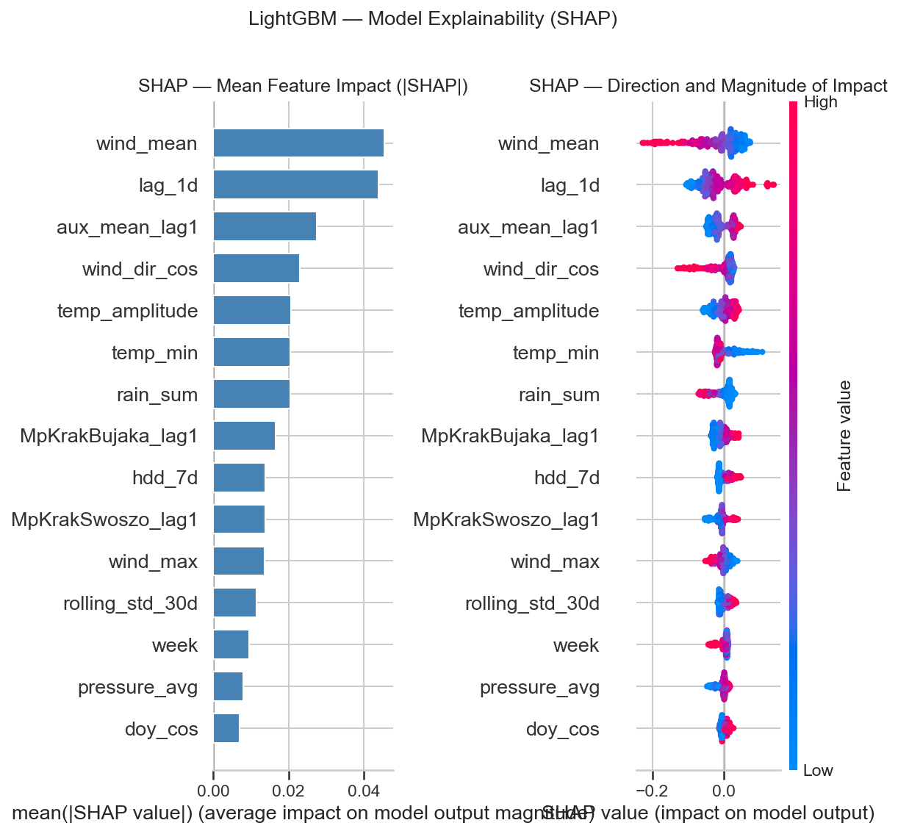

SHAP values from the LightGBM model confirm that **lag features and rolling means dominate predictions**, followed by heating-season indicators and inversion proxies. Weather interaction terms (e.g., `hdd_calm`, `inversion_proxy`) consistently rank in the top 15 features, validating the domain-driven feature design.

---

## 7. Modeling

Three complementary modelling approaches were used to cover different aspects of the forecasting problem:

### LightGBM (primary model)

A gradient-boosted decision tree model that operates on the full engineered feature set.

- **Why:** Handles non-linear interactions, missing values, and heteroscedastic targets natively; fastest to train; supports SHAP
- **Training:** Early stopping on a chronological 15% holdout of training data; optional Optuna hyperparameter search
- **Target:** Box-Cox-transformed PM10; predictions are back-transformed at evaluation time
- **Split:** Strict time-series split — no shuffling

### SARIMAX (statistical baseline with weather)

Seasonal ARIMA with exogenous regressors, order selected via `pmdarima.auto_arima` with weekly seasonality (`m=7`).

- **Why:** Interpretable; captures linear AR/MA dynamics explicitly; exogenous weather variables (`temp_avg`, `wind_max`, `is_heating_season`, `inversion_proxy`, etc.) are included as regressors
- **Training:** Walk-forward validation with full refit every 7 steps; exogenous features are standardised on the training set only
- **Confidence intervals:** Available from the SARIMAX state-space covariance

### Prophet (trend + seasonality decomposition)

Facebook's additive decomposition model.

- **Why:** Robust to missing data; explicitly models yearly and weekly seasonality with holiday effects; interpretable trend changepoints
- **Autoregressive extension:** A 7-day lagged rolling mean of the Box-Cox target (`rolling_bc_7d`) is appended as an extra regressor to give Prophet short-term memory
- **Polish holidays:** Added via `add_country_holidays(country_name="PL")`
- **Mode:** Multiplicative seasonality (appropriate for the variance structure of PM10)

### ARIMA (pure time-series baseline)

A non-seasonal ARIMA fitted on the Box-Cox series, order selected by ADF stationarity test + `auto_arima`.

- **Why:** Serves as a reference point for how much is gained by adding weather covariates and richer features
- **Walk-forward:** Same refit schedule as SARIMAX, with 90% prediction intervals

### Naïve persistence baseline

`PM10(t+1) = PM10(t)` — predicts tomorrow equals today. All models are benchmarked against this baseline; meaningful improvement over persistence is the minimum bar for a useful forecast.

---

## 8. Evaluation

All metrics are computed on **back-transformed µg/m³ values** to be directly interpretable.

### Regression metrics

| Metric | Formula | Purpose |
|---|---|---|
| **R²** | 1 − SS_res / SS_tot | Overall variance explained; 1 is perfect |
| **MAE** | mean(\|y − ŷ\|) | Average absolute error in µg/m³; robust to outliers |
| **RMSE** | √mean((y − ŷ)²) | Penalises large errors more heavily; sensitive to smog peaks |
| **MAPE** | mean(\|y − ŷ\| / y) × 100 | Scale-free percentage error (computed only for y > 5 µg/m³) |
| **SMAPE** | Symmetric MAPE variant | Bounded, handles low-concentration days more fairly |

### Exceedance classification metrics

Since **health impact depends on whether the 50 µg/m³ EU limit is breached**, a binary classification view is computed alongside regression metrics:

| Metric | Purpose |
|---|---|
| **Precision** | Of all predicted exceedances, how many were real? |
| **Recall** | Of all real exceedances, how many were caught? |
| **F1** | Harmonic mean — balances false alarms and missed events |

For public-health use cases, **recall is prioritised**: missing a real smog day is more costly than a false alarm.

### Model comparison

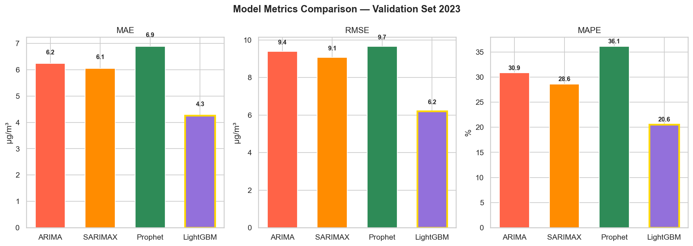

LightGBM achieves the lowest RMSE and MAE on the validation set, followed by SARIMAX. All models substantially outperform the naïve persistence baseline on exceedance recall, confirming the value of weather-driven features.

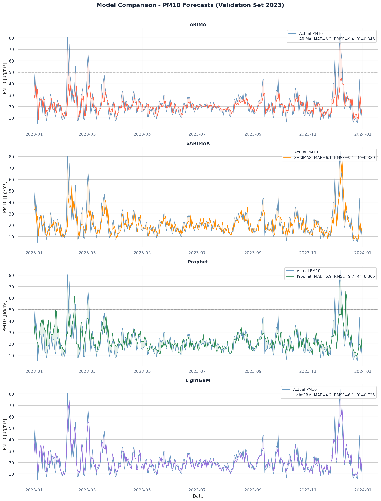

---

## 9. Advanced Analysis

### Stratified analysis

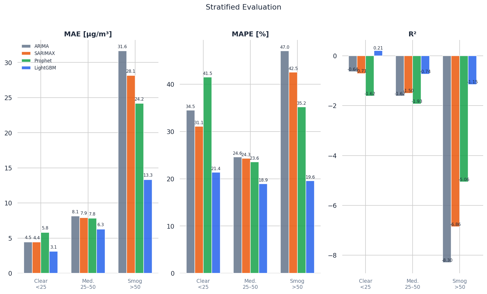

Metrics are broken down by **pollution regime** (Clean / Moderate / Polluted) and by **season** to reveal where each model struggles. Models perform well in moderate conditions but underestimate the highest peaks. LightGBM shows the best recall during Polluted episodes, while SARIMAX is more reliable in clean-air periods.

### Validation vs. test performance

The validation period (2023) and the held-out test period (2024) show a **notable gap in performance**, with test metrics being weaker. Likely causes:

- **Distribution shift:** The 2024 season had an unusual weather pattern not well-represented in training data
- **Heating policy changes:** The Małopolska anti-smog regulation tightened in 2023–2024, shifting the base pollution level downward relative to prior years
- **Overfitting to validation period:** Hyperparameter tuning was informed by validation-set performance

### Exceedance classification

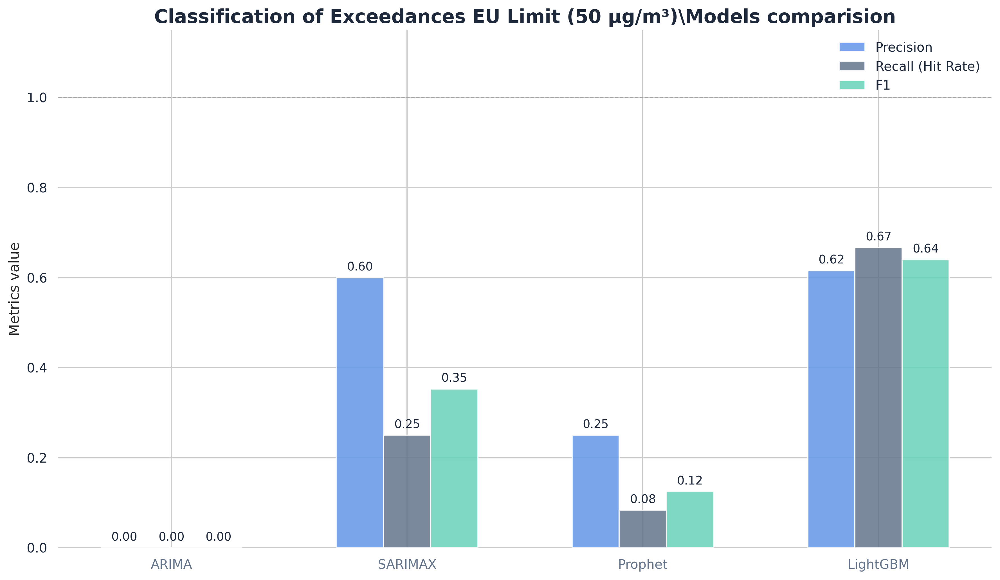

A dedicated binary classifier predicts whether a given day will breach the 50 µg/m³ threshold. This framing treats the problem as an early-warning task: the goal is high recall (catching real events) even at the cost of some false positives.

### Smog episode detection

Beyond single-day exceedances, **consecutive smog days** are grouped into episodes. The episode-level analysis provides:

- Number and duration of multi-day smog events per year
- Spatial coherence — whether all four stations are simultaneously elevated
- A timeline of historical episodes (see `images/exceedance_timeline.png`)

This forms the basis for a future proactive alert system.

---

## 10. Streamlit Application

The **AirPulse Kraków** dashboard (`frontend/app.py`) is a dark-themed interactive web application.

### Features

**Forecast panel**
- Select model: `LightGBM`, `SARIMAX`, or `ARIMA`
- Set forecast date and horizon (1–7 days)
- Input weather conditions: temperature, wind, pressure, precipitation
- Returns PM10 point forecast with upper/lower confidence bounds plotted on an interactive Plotly chart
- Colour-coded PM10 level indicator: Good / Moderate / High / Very High

**SHAP explainability panel** (LightGBM only)
- Waterfall chart showing top feature contributions to the current forecast
- Hover for feature values and SHAP attribution magnitudes

**AI interpretation**
- Rule-based natural-language generation engine produces a plain-English summary of the forecast
- Summarises dominant weather drivers, health implications, and recommended actions scaled to the forecasted severity level

**PDF report generation**
- One-click export of the current forecast, SHAP explanations, and AI narrative as a structured A4 PDF (`reportlab`)

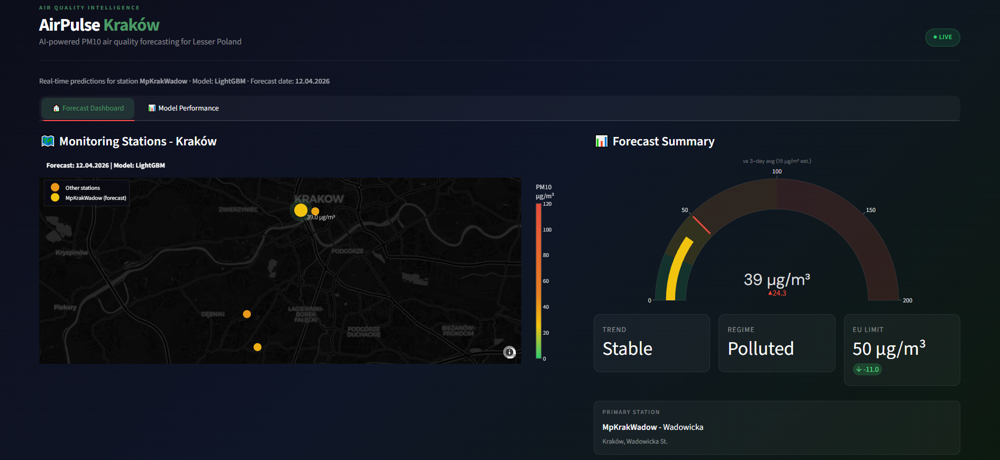

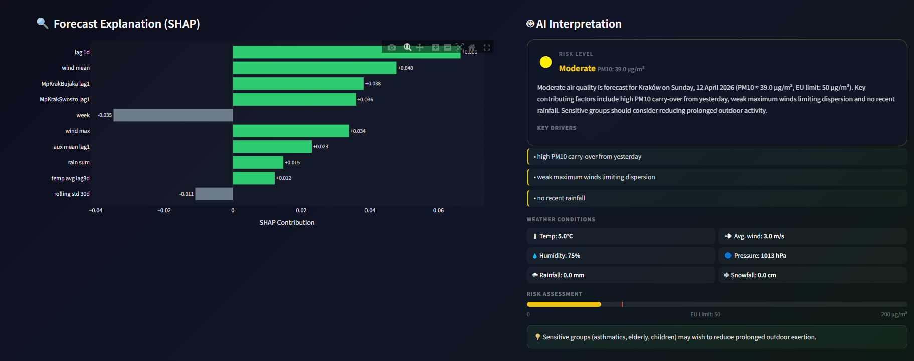

**Model performance panel**
- Live model metrics table fetched from the `/metrics` endpoint
- Side-by-side comparison of MAE, RMSE, SMAPE across models

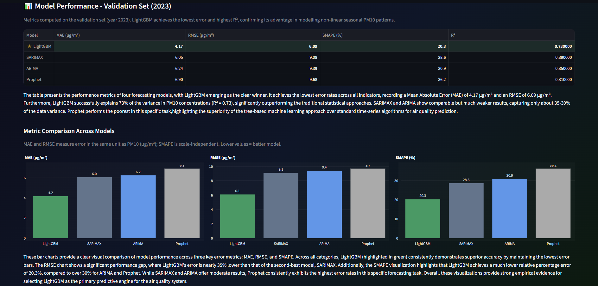

---

## 11. FastAPI Backend

The API (`backend/api.py`) is the central serving layer for all model inference.

### Endpoints

| Method | Path | Description |
|---|---|---|
| `POST` | `/predict` | Multi-day PM10 forecast for a selected model |
| `GET` | `/metrics` | Pre-computed validation metrics for all models |
| `POST` | `/explain` | SHAP feature attributions (LightGBM only) |
| `POST` | `/interpret` | Rule-based NLG narrative for a forecast |
| `GET` | `/health` | Liveness check — reports loaded models and history size |

### Design notes

- **Lifespan startup:** Models are loaded once into a `ModelService` singleton at startup; no cold-load latency on requests
- **CORS:** Open (`allow_origins=["*"]`) for local development; restrict in production
- **Regime classification:** A `KMeans(3)` model clusters weather conditions into Clean / Moderate / Polluted regimes for contextual display
- **Confidence intervals:** Available for ARIMA (state-space covariance) and approximated for LightGBM

**Run locally:**
```bash
uvicorn backend.api:app --reload --port 8000
```

**Interactive docs:** `http://localhost:8000/docs`

---

## 12. Docker Setup

The system is fully containerised with **two services** sharing a private bridge network.

```yaml
# docker-compose.yml (simplified)
services:
  backend:
    build: { dockerfile: backend/Dockerfile }
    ports: ["8000:8000"]
    volumes: ["./models:/app/models:ro"]
    healthcheck: { test: ["CMD", "python", "/app/backend/healthcheck.py"] }

  frontend:
    build: { dockerfile: frontend/Dockerfile }
    ports: ["8501:8501"]
    environment: { API_HOST: "http://backend:8000" }
    depends_on: { backend: { condition: service_healthy } }
```

Key design decisions:

- The `models/` directory is mounted **read-only** into the backend container; no model files are baked into the image
- The frontend **waits for the backend health check to pass** before starting, preventing connection errors at launch
- `restart: unless-stopped` ensures automatic recovery from transient failures
- Environment variables (`BACKEND_PORT`, `FRONTEND_PORT`, `LOG_LEVEL`) can be overridden via `.env`

**Pre-requisite:** Generate model artefacts on the host before the first Docker run:
```bash
python scripts/prepare_api_artifacts.py
```

---

## 13. Business Insights

### A. Technical insights

- **Lag features dominate:** `lag_1d` is consistently the most important feature across all models, confirming strong autocorrelation in daily PM10
- **Weather interactions matter:** `hdd_calm` (heating degree days × calm wind) and `inversion_proxy` significantly improve exceedance recall — simple weather variables alone are insufficient
- **LightGBM outperforms classical models** on all regression metrics; SARIMAX is competitive on clean-air days and provides better probabilistic calibration
- **Box-Cox transformation is essential:** Without it, all models produce larger errors on high-concentration days due to heavy-tailed residuals
- **Multi-station spatial features add value:** Auxiliary station lag-1 readings from Swoszowice and Bujaka improve both validation MAE and exceedance recall, confirming regional pollution coherence

### B. Non-technical insights

- **Winter is the critical period:** The vast majority of EU limit exceedances occur between October and March; summer forecasts are straightforward and carry minimal health risk
- **Calm, cold, dry nights are the danger signal:** The combination of below-freezing temperatures, no wind, and no recent rain creates stagnant air conditions that trap coal-combustion emissions from residential heating
- **A few days of lag drive the forecast:** If PM10 was high yesterday, it is almost certain to be elevated today — real-time sensor data is therefore the most valuable input
- **Residents can act on 1-day forecasts:** Kraków operates a public alert system; a reliable 24-hour forecast allows vulnerable residents, schools, and cyclists to plan accordingly
- **Policy impact is measurable:** The Małopolska anti-smog regulation appears to have lowered baseline winter concentrations after 2022, visible as a downward trend in the year × month heatmap

---

## 14. Conclusion

### Summary

This project delivers a complete, production-oriented PM10 forecasting pipeline — from raw GIOŚ Excel files to a live REST API and interactive dashboard. LightGBM achieves the best overall performance, powered by a rich set of lag, rolling, weather, and interaction features engineered from domain knowledge. SARIMAX and Prophet add interpretability and serve as useful ensemble candidates.

### Strengths

- Strict temporal data splits at every stage — no leakage
- Domain-aware feature engineering guided by atmospheric physics
- SHAP-based interpretability for every prediction
- Full observability: structured logging throughout the `src/` pipeline
- Containerised, reproducible deployment

### Limitations

- **Single-station target:** The primary forecast is for `MpKrakWadow` only; a multi-target model would generalise better across the city
- **No real-time data feed:** Weather inputs must be provided manually or via a future integration with a live forecast API
- **Distribution shift in 2024:** The model was validated on 2023 data; test performance on 2024 indicates the need for periodic retraining as emission patterns evolve

### Future improvements

- **Online retraining:** Scheduled weekly refit on the most recent 30 days
- **Ensemble model:** Weighted combination of LightGBM and SARIMAX to exploit their complementary strengths
- **Real-time weather integration:** Replace manual weather input with automatic Open-Meteo forecast API calls
- **Multi-day probabilistic forecasts:** Extend confidence intervals to a full 7-day quantile forecast
- **Push alerts:** Notify users when exceedance probability exceeds a configurable threshold

---

## 15. How to Run

### Option A — Docker (recommended)

**Requirements:** Docker Desktop, model artefacts in `models/`

```bash
# 1. Generate model artefacts (run once, on host)
python scripts/prepare_api_artifacts.py

# 2. Start both services
docker-compose up --build

# 3. Open the dashboard
#    http://localhost:8501

# 4. Explore the API
#    http://localhost:8000/docs
```

To stop:
```bash
docker-compose down
```

---

### Option B — Local (development)

**1. Install dependencies**

```bash
pip install -r requirements.txt
```

**2. Generate model artefacts**

```bash
python scripts/prepare_api_artifacts.py
```

**3. Start the backend**

```bash
uvicorn backend.api:app --reload --port 8000
```

**4. Start the frontend** (in a separate terminal)

```bash
streamlit run frontend/app.py
```

**5. (Optional) Run the full pipeline notebook**

```bash
jupyter lab notebooks/air_quality_forecast.ipynb
```

---

### Environment variables

| Variable | Default | Description |
|---|---|---|
| `API_HOST` | `http://localhost:8000` | Backend URL seen by the frontend |
| `BACKEND_PORT` | `8000` | Backend listen port |
| `FRONTEND_PORT` | `8501` | Frontend listen port |
| `LOG_LEVEL` | `info` | Uvicorn/Python log level |

Copy `.env` and adjust as needed before running.

---

## Tech Stack

`Python 3.11+` · `pandas` · `numpy` · `scikit-learn` · `LightGBM` · `statsmodels` · `pmdarima` · `Prophet` · `SHAP` · `Optuna` · `FastAPI` · `Pydantic` · `Streamlit` · `Plotly` · `Docker` · `scipy` · `holidays` · `reportlab`

---

## License

[MIT](LICENSE)